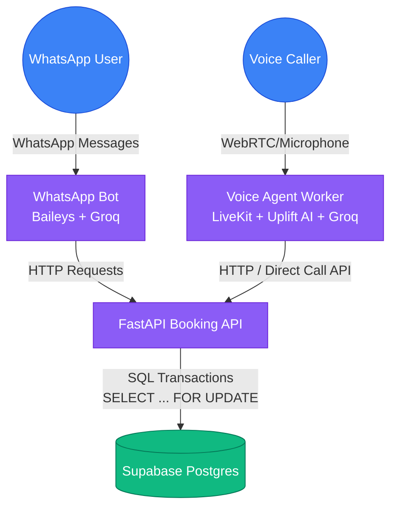
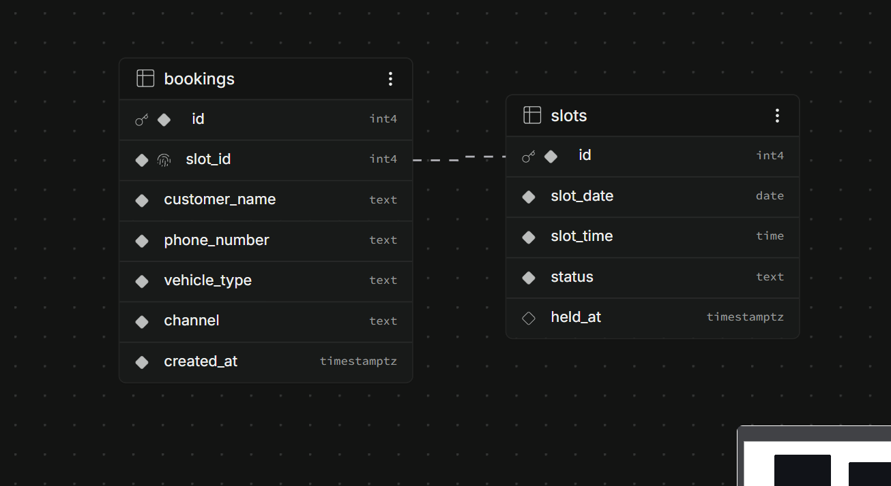
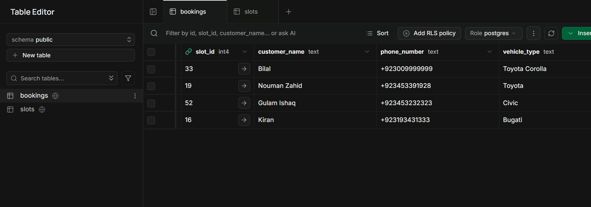
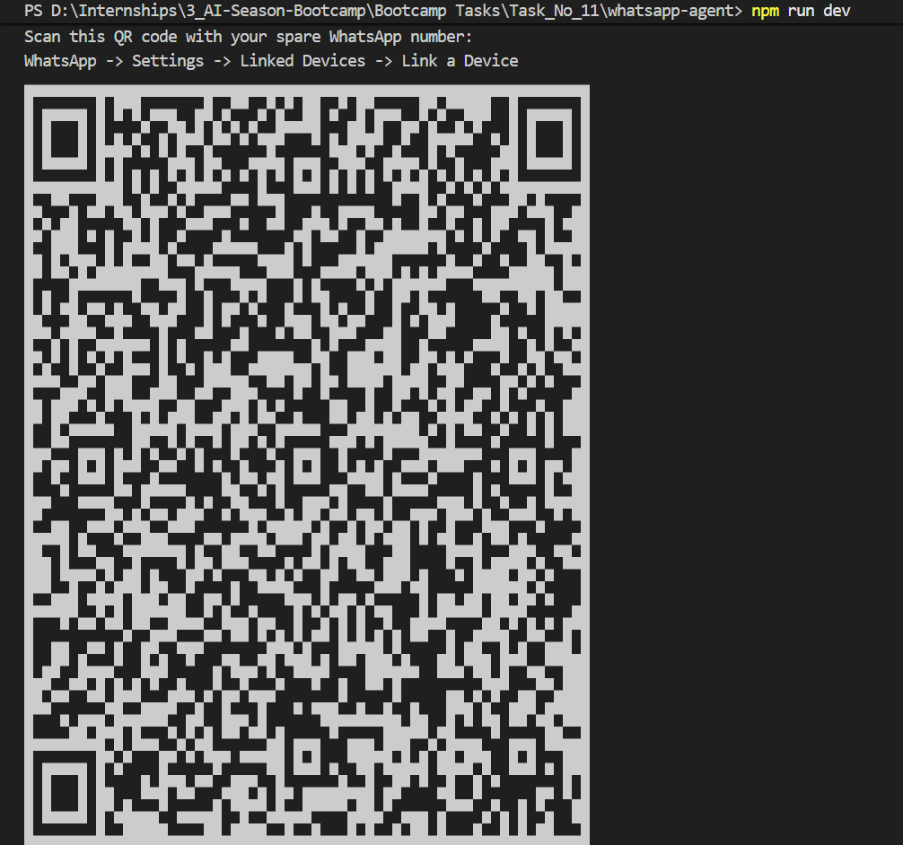
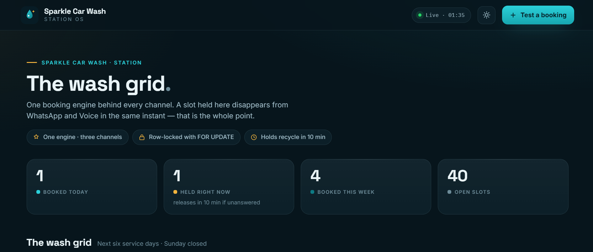
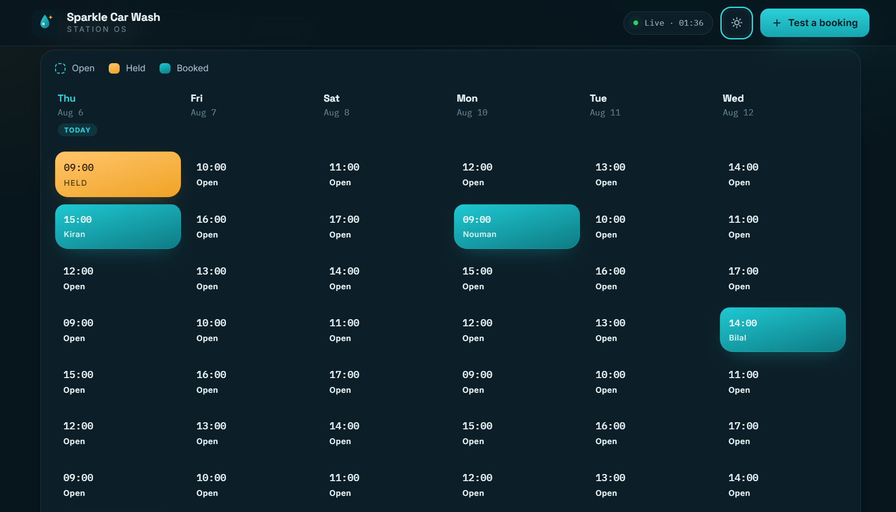
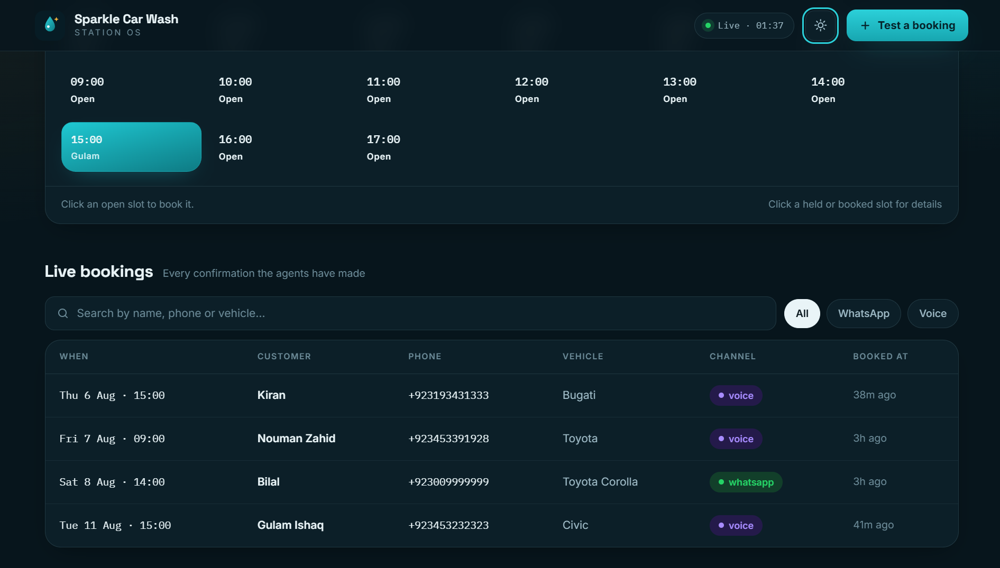

# Car Wash Dual-Channel Booking Agent 🚗🧼

A unified, production-grade conversational booking system for a single-location car wash. This system integrates two communication channels:

1. **WhatsApp Agent:** A Node.js service using Baileys to converse via WhatsApp messages.
2. **Voice Agent:** A Python service using LiveKit, Uplift AI, and Groq to handle real-time spoken conversations.

Both agents connect to a single, shared, deterministic **FastAPI Booking Engine** backed by **Supabase (PostgreSQL)**, ensuring a slot held or booked on one channel is immediately unavailable on the other, eliminating the risk of double-booking.

---

## Architecture Overview



---

## The "No Double-Booking" Guarantee

In conversational AI systems, LLMs cannot be trusted to manage application states. Letting the model decide booking confirmation directly leads to double-booking due to race conditions or model hallucination.

Here, **the LLM is strictly a language interface**. State transitions are mediated by the **FastAPI Engine** using database row-level locking:

1. When a slot is requested, the system attempts to `SELECT ... FOR UPDATE` on the slot row. This blocks concurrent requests from reading or modifying the same row.
2. If the slot is `available` (or has an expired hold), the engine sets the status to `held` with a 10-minute TTL (`HOLD_TTL_MINUTES = 10`), freeing the agent to collect client details like name and vehicle type.
3. Once all details are gathered, the agent calls `confirm_booking`. The db transaction updates the slot to `booked` and inserts the booking record.
4. If a concurrent agent (e.g. WhatsApp or another Voice line) tries to hold or book the same slot, the database lock ensures they must wait, and subsequent checks fail (returning `success: false`), which is communicated to the user.

### Database Schema Design

The relational schema uses PostgreSQL to track slots and customer bookings with proper foreign keys and indices for high performance.


_Figure 1: Database relations representing slots and final bookings._


_Figure 2: Real-time visual tracking of slots and hold timestamps in the Supabase Dashboard._

---

## Environment Variables Configuration

Create a `.env` file in the root directory (and copy to subprojects if required).

```env
DATABASE_URL="postgresql://<user>:<password>@<host>:5432/postgres"
GROQ_API_KEY="your-groq-api-key"
UPLIFTAI_API_KEY="your-upliftai-key"
BOOKING_API_URL="http://localhost:8100"
LIVEKIT_URL="wss://<your-project>.livekit.cloud"
LIVEKIT_API_KEY="your-livekit-api-key"
LIVEKIT_API_SECRET="your-livekit-api-secret"
```

- **`DATABASE_URL`**: Your Supabase Postgres connection string.
- **`GROQ_API_KEY`**: Key for the Groq Cloud Console.
- **`UPLIFTAI_API_KEY`**: Key from the Uplift AI Dashboard.
- **`BOOKING_API_URL`**: The local or deployed URL of your FastAPI service (e.g. `http://localhost:8100`).
- **`LIVEKIT_URL` / `API_KEY` / `API_SECRET`**: WebRTC streaming configuration from your LiveKit Cloud project.

---

## Setup & Running Instructions

### 1. Database Setup

Ensure that your database schema and seed data are initialized:

```bash
# From the root directory
python shared/seed_slots.py
```

### 2. Running the Booking API

The FastAPI engine handles all database transactions and provides the booking endpoints.

```bash
cd booking-api
# Install dependencies (requires virtual environment)
pip install -r requirements.txt
# Run the API
uvicorn main:app --host 127.0.0.1 --port 8100 --reload
```

You can access the admin dashboard at `http://localhost:8100/admin/bookings`.

### 3. Running the WhatsApp Agent

The Node-based Baileys agent handles WhatsApp message triggers.

```bash
cd whatsapp-agent
# Install dependencies
npm install
# Run in development mode
npm run dev
```

Scan the QR code printed to the terminal with your WhatsApp device to link the session.


_Figure 3: Baileys console QR terminal printout for linked device pairing._

### 4. Running the Voice Agent Worker

The Python-native LiveKit worker handles low-latency WebRTC streams.

```bash
cd voice-agent
# Activate the virtual environment
venv\Scripts\activate  # Windows
# or: source venv/bin/activate  # macOS/Linux

# Install dependencies
pip install -r requirements.txt
# Run the worker process
python src/main.py dev
```

Wait for the worker terminal to output:
`registered worker {...}`. Keep this terminal open.

---

## Visual Chat Flows & Demos 📱🤖

Here is a step-by-step walkthrough of the WhatsApp AI Agent dynamically managing holds, checking availability, gathering user parameters, and successfully executing a transactional booking:

### Step 1: Availability Check

The user messages the bot requesting details. The bot pulls slot information directly from the database and presenting options conversationally.



### Step 2: Slot Hold & Info Collection

Once the user chooses a slot, the system locks that row in PostgreSQL with a 10-minute hold and proceeds to collect the customer name and vehicle type.



### Step 3: Transaction Database Confirmation

Once all parameters are gathered, a confirmation call is made to the engine, committing the slot permanently to the table and greeting the user with a confirmation code.



---

## Voice Agent Testing & Troubleshooting Guide 🎤⚡

### Method 1: Manual Live Browser Test (Recommended)

This approach lets you speak into your microphone and hear the voice agent talk back.

1. **Mint a fresh session token:**
   Open a separate terminal and run:

   ```bash
   cd voice-agent
   venv\Scripts\python.exe make_token.py
   ```

   _This automatically generates a unique room ID (e.g. `sparkle-64e8ea`) to force dispatch logic, and prints a URL along with a JWT._
2. **Access the Playground:**

   - Go to [LiveKit Cloud Console](https://cloud.livekit.io/) and log in (required to view the Playground interface).
   - Navigate to the **Playground** (or go directly to [agents-playground.livekit.io](https://agents-playground.livekit.io/)).
3. **Verify Settings (Connection Sheet):**

   - Paste the **LiveKit URL** and the **Raw Token** outputted by `make_token.py` into the **Manual** tab.
   - **Agent Name**: **Leave entirely blank / empty**. Our local agent is unnamed; selecting a name will block dispatching.
   - **Participant Identity**: Enter any name (e.g. `client`).
   - **Room Name**: Keep the unique room ID outputted by the token script to ensure fresh dispatch.
4. **Connect & Speak:**

   - Click **Connect** and accept browser microphone permissions.
   - Say: _"Hi, I want to book a car wash."_

---

### Method 2: Programmatic Script Test (Automated)

If you want to test the voice agent's processing pipeline automatically without a microphone:

1. **Provide a mock audio input:**
   Place a voice request `.wav` recording at:
   `C:\Users\HP\AppData\Local\Temp\opencode\test_utterance.wav` (or update line 21 in `test_call.py` with your WAV file path).
2. **Execute the runner:**
   ```bash
   cd voice-agent
   venv\Scripts\python.exe test_call.py
   ```
3. **Verify Results:**
   The script will log connections, stream the voice wav to LiveKit, and show how many audio frames the agent sent back.

---

### Troubleshooting Common Voice Agent Issues

- **Issue: "The agent doesn't join the room"**

  - **Fix 1 (Room Reuse):** LiveKit auto-dispatches agents **only upon room creation**. If you reuse a room name that was connected recently, LiveKit treats it as active and won't dispatch the worker. Always use a random room name (like the token script generates).
  - **Fix 2 (Agent Name mismatch):** Do not select or write an Agent Name in the console playground. Leave the field blank.
  - **Fix 3 (Verify Worker logs):** Ensure your worker terminal prints `connected to playground` and `registered worker`. If it has errors, check that `.env` coordinates are correct and Groq/Uplift keys are valid.
- **Issue: "The agent is in the room, but silent"**

  - **Fix 1 (VAD Trigger):** The agent does not start talking. It waits for Voice Activity Detection (VAD) to hear you speak. Speak clearly: _"Can you check slot availability?"_
  - **Fix 2 (Microphone Access):** Check your browser permissions to ensure the microphone selection is correct and unmuted.
  - **Fix 3 (Audio Output):** Check system output settings to verify that sound isn't routing to an inactive bluetooth device or muted speaker.

---

## Known Current Limitations

- **No Admin Authentication:** The `/admin/bookings` endpoint does not require credentials (v1 design choice).
- **Temporary Holds:** Non-confirmed slots held by walk-away users are automatically recycled after 10 minutes.
- **No Cancellation or Rescheduling:** Users can only book slots. Cancellations or modifications must be done directly in the database.
- **No PSTN Calling:** The voice agent only runs directly over a web platform playground via WebRTC/browser.
- **In-Memory Conversations:** Message history resets when the Node or Python worker processes restart.
